# 在线房屋交易平台 后端项目

## 项目简介


[](https://opensource.org/licenses/MIT)


项目后端所用到的技术栈:

Golang + Gin + Gorm + MySQL + Docker + Nginx


样例项目部署在了服务器 124.223.10.155:8080 上,服务器使用了Nginx进行了反向代理,同时MySQL安装在了服务器上

后端项目仓库:

[gitee仓库](https://gitee.com/Aspirin-Byte/online-house-trading-platform)

[github仓库](https://github.com/Neon-Rainbow/online-house-trading-platform)


## 项目部署

### 不使用容器化技术部署

#### 操作系统

在不使用容器化技术的情况下,项目在MacOS,Windows和Ubuntu系统下运行正常,以下是运行正常的各个系统的基本信息:

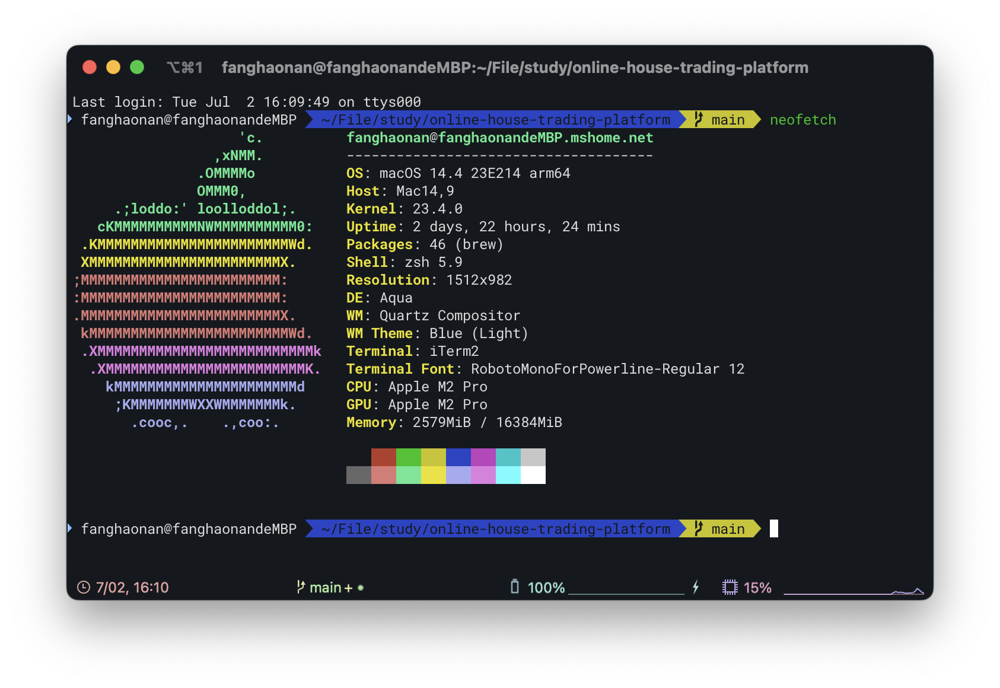

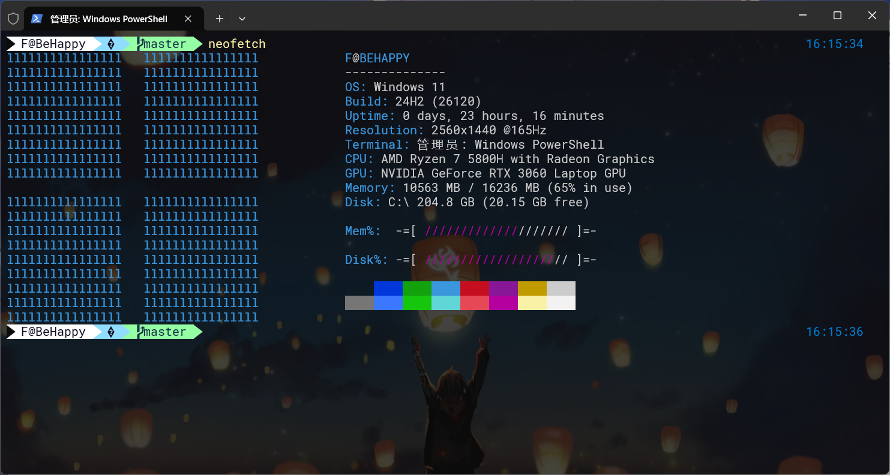

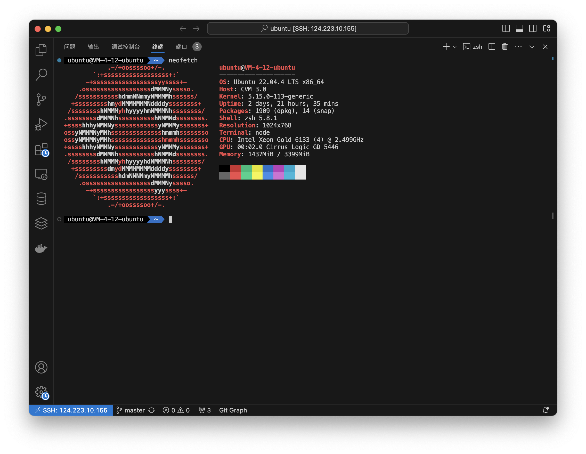

------

#### Golang环境

项目需要Go 1.22 来运行后端项目

具体可以终端输入

```bash
go version
```

来查看

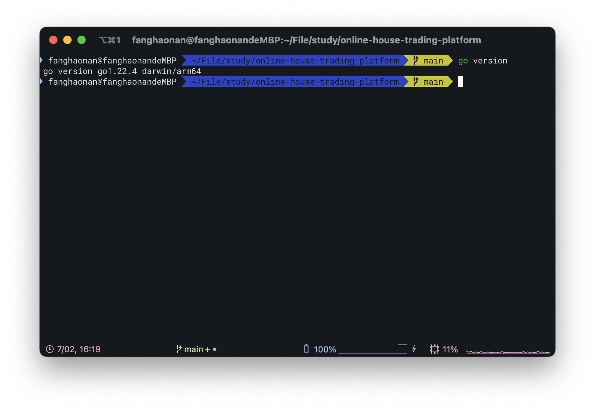

------

#### 运行代码

如果只需要运行代码,暂时不需要编译,可以在终端输入

```bash
go run ./main.go
```

如果需要将项目编译成二进制文件,然后运行二进制文件,则可以在终端输入:

```
go build -o ./main .
./main
```


### 使用Docker

首先需要配置docker环境,可以在终端输入

```bash
docker version
```

如果显示的内容和下图类似,则证明Docker环境成功配置

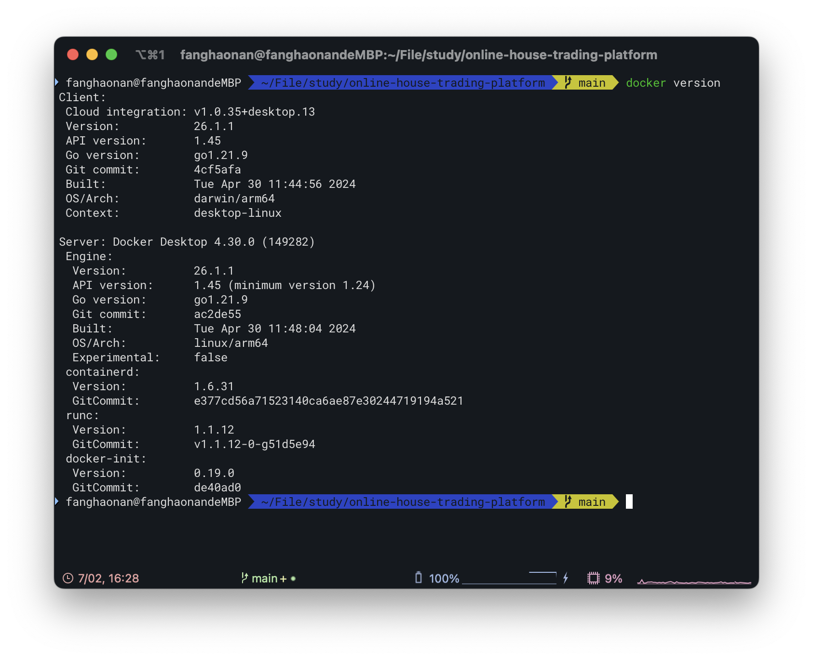

项目需要用到的Docker镜像为

```
golang:1.22
```

可以提前在终端输入

```
Docker pull golang:1.22
```

来下载Docker镜像以加快Docker镜像的制作时间

DockerFile具体内容如下:

```dockerfile
FROM golang:1.22

WORKDIR /app

COPY go.mod go.sum ./
RUN go mod download

COPY . .

RUN go build -o ./main .

CMD ["./main"]

EXPOSE 8080
```

可以根据项目需要,修改

```dockerfile
EXPOSE 8080
```

来修改Docker镜像中的项目的监听的端口

然后使用

```bash
docker build -t online-house-trading-platform .
```

制作Docker镜像

制作过程:

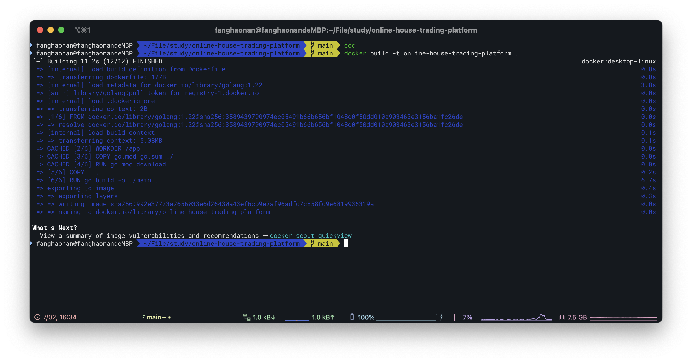

可以输入

```bash
docker images
```

查看docker镜像是否成功制作

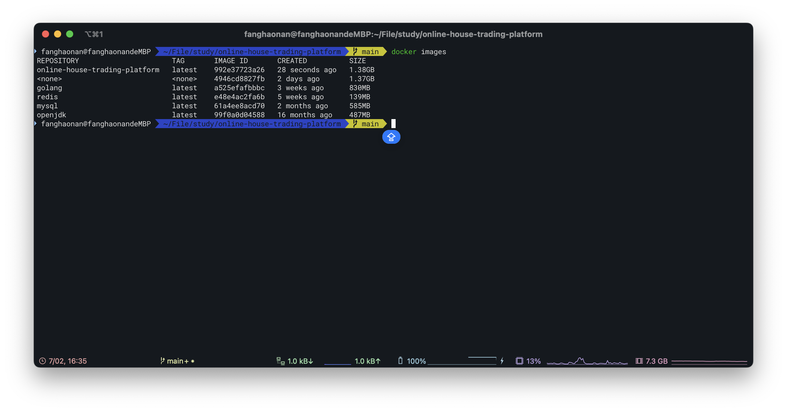

这里可以看到REPOSITORY中出现了online-house-trading-platform ,证明docker镜像制作完成


然后使用下列指令运行Docker镜像:

```
docker run -d --name online-house-trading-platform -p 8080:8080 online-house-trading-platform 
```

可以根据自身需要,修改冒号前面的数字,来修改Docker镜像监听的接口

然后输入

```
docker ps
```

查看当前运行的Docker镜像有哪些

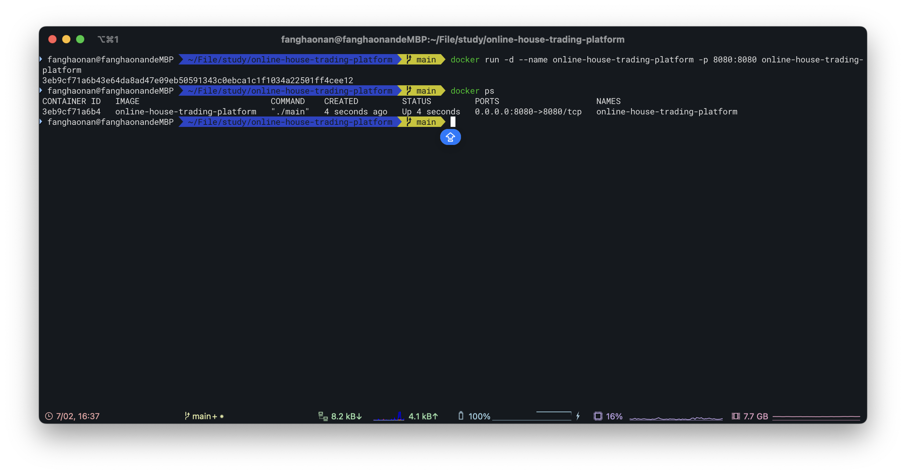

可以看到Docker镜像成功运行

然后终端输入

```bash
curl 127.0.0.1:8080/ping
```

如果显示内容为

```json
{"message":"pong"}
```


如图所示,则说明项目运行成功

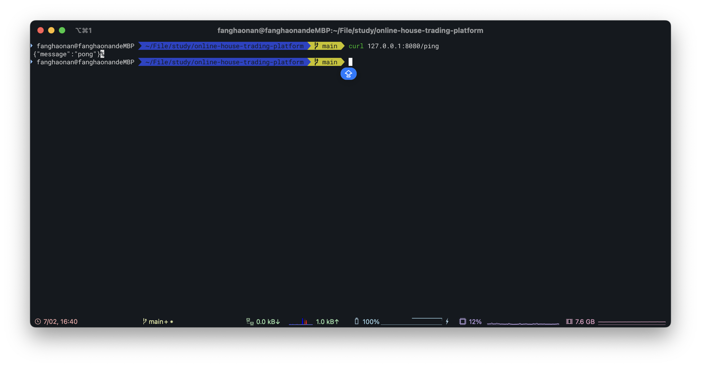

## 项目配置文件

项目的配置文件需要存放在项目根目录的config.json中,如果没有改文件,则需要自行创建改文件

文件的格式:

```json
{
  "database": {
    "host": "127.0.0.1",
    "port": 3306,
    "user": "ubuntu",
    "password": "123456",
    "dbname": "online_house_trading"
  },
  "jwtSecret": "爱得那么认真 爱得那么认真\n可还是听见了你说不可能\n已经十几年没下雪的上海突然飘雪\n就在你说了分手的瞬间",
  "passwordSecret": "雪下得那么深 下得那么认真\n倒映出我躺在雪中的伤痕\n我并不在乎自己究竟多伤痕累累\n可我在乎今后你有谁陪",
  "logFilePath": "./application.log",
  "port": 8080,
  "ginMode": "debug",
  "zapLogLever": "debug",
  "admin_register_secret_key": "admin_register_secret_key"
}
```

如果需要修改项目的数据库配置,则修改json文件中的database

如果需要修改项目的默认端口,则修改port

如果需要修改项目日志文件的输出位置,则修改logFilePath

jwtToken是项目的jwt token的生成密钥

passwordSecret时项目的密码在数据库中的加密密钥

## 项目在服务器上的部署

项目可以通过`项目部署`中的内容,将项目部署在服务器上

docker镜像通过ftp上传到了服务器上

该后端项目以及被部署在了服务器上,服务器IP地址为124.223.10.155,项目运行在服务器的8080端口上

由于该服务器内存较小,因此有时服务器运行后由于内存不足会停止项目

在服务器上,项目运行在了8081端口.同时服务器使用了Nginx进行了反向代理

Nginx配置:

```json
server {
    listen 8080;
    server_name 124.223.10.155;
    
    client_max_body_size 10M;  # 允许的最大请求体大小
    large_client_header_buffers 4 16k;  # 允许的最大请求头大小

    location / {
        proxy_pass http://127.0.0.1:8081;  # 将请求转发到你的Gin项目
        proxy_set_header Host $host;
        proxy_set_header X-Real-IP $remote_addr;
        proxy_set_header X-Forwarded-For $proxy_add_x_forwarded_for;
        proxy_set_header X-Forwarded-Proto $scheme;
    }
}
```

Nginx监听了服务器的8080端口,同时将8080端口的http请求转发到了服务器的8081端口,即后端项目运行的端口

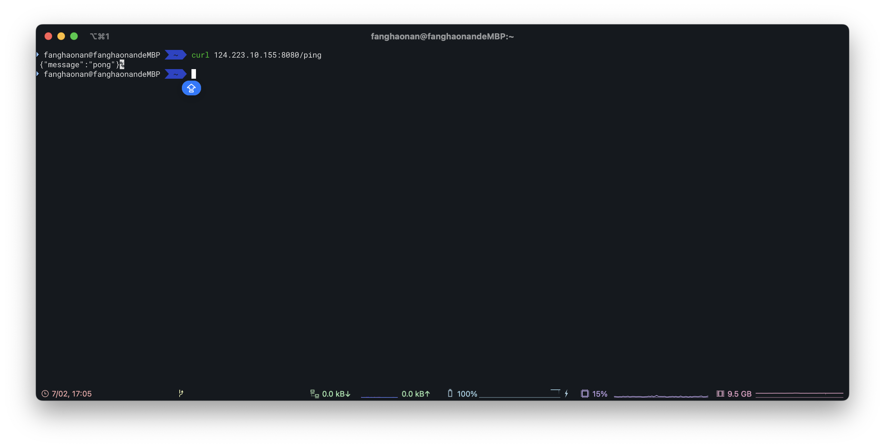

可以看到服务器上的项目成功运行

## 项目部署图


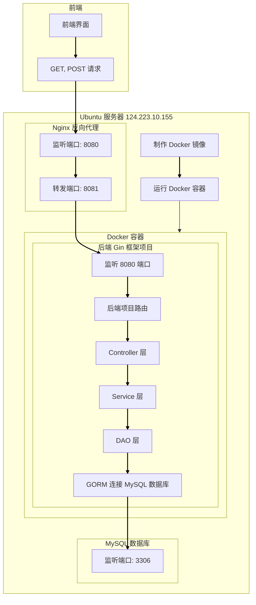

